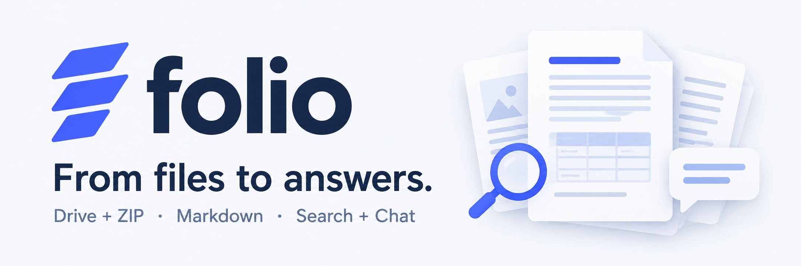
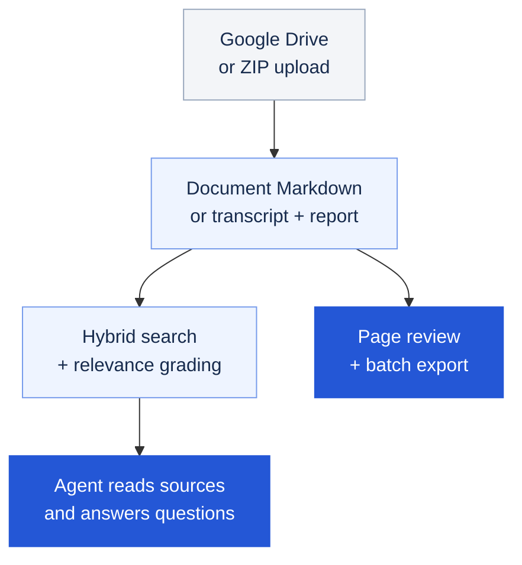

# Folio

**Turn mixed files into Markdown you can review, knowledge you can search, and answers you can trace to sources.**

Bring a project's PDFs, slide decks, spreadsheets, screenshots, and meeting recordings into one workbench. Folio imports them from **Google Drive or a ZIP**, processes their contents, and lets you search and ask questions across an isolated document library.

[Get started](docs/getting-started.md) · [User guide](docs/workflow.md) · [Architecture](docs/architecture.md) · [All documentation](docs/README.md)

## What you can do

| Capability | What you get |
| --- | --- |
| **Import a collection** | Read a Drive folder or upload a ZIP, including nested files. Each import becomes a separate library. |
| **Extract and review content** | Whole-document Markdown with page previews; complete audio transcripts with separate reports. Compare results against the source. |
| **Search beyond keywords** | Combine semantic and keyword retrieval, then grade the full text of matching documents for relevance to your question. |
| **Ask across documents** | An Agent retrieves and reads source files to answer questions and compare evidence. Inspect source links and its activity log. |
| **Evaluate answers** | Review answer scores, prompt suggestions, recorded model usage, and estimated costs. |
| **Take the results with you** | Export Markdown, transcripts, reports, source metadata, and parsing audit records in a batch archive. |

Supports **PDF, Office files, images, text/HTML, audio, and video audio tracks**. See [formats and limits](docs/formats-and-limits.md) for the complete list.

## From files to answers



Document parsing handles a complete PDF in one request and checks page coverage. Retrieval uses chunks to find candidates; relevance grading reads the full document. The chat Agent then receives verified files for reading. [Explore the pipeline →](docs/architecture.md)

## The technology behind it

| Layer | Technology | Role in Folio |
| --- | --- | --- |
| Workbench | **React + Vite · FastAPI** | Import jobs, page review, search, chat, evaluations, and usage in one local interface. |
| Content processing | **OpenAI · LibreOffice · PyMuPDF · Playwright · FFmpeg** | Convert documents, parse complete PDFs, transcribe media, and generate separate reports. |
| Retrieval | **OpenAI embeddings + Qdrant** | Dense semantic search and sparse BM25 keyword search, combined with reciprocal rank fusion (RRF). |
| Relevance and evaluation | **TypeSafe JEV or OpenAI Decisions** | Choose a provider to grade full candidate documents and evaluate answers against captured evidence. |
| Document chat | **OpenAI Agents API** | A hosted Agent environment with library-scoped search, file transfer, and reading tools. |
| Source storage | **Google Drive + Cloud Storage · SHA-256** | Read Drive sources, retain ZIP originals locally, and store Markdown with pinned versions and hash verification. |

Folio is a **local, single-user app that uses cloud APIs**. OpenAI and Google Cloud Storage are needed for the complete workflow, including ZIP libraries. Scoring and evaluation default to JEV; you can select OpenAI Decisions instead in search, conversation settings, and evaluations. Model results remain reviewable, and oversized or incomplete processing fails visibly. See [data, privacy, and costs](docs/privacy-and-costs.md).

## Quick start

Install **Python 3.11+**, **Node.js 20.19+ or 22.12+**, **Git**, **LibreOffice**, and **FFmpeg**. The [installation guide](docs/getting-started.md) covers platform details and service prerequisites.

```bash
git clone https://github.com/michae1hsu/folio.git
cd folio
```

Run setup for your platform:

| Platform | Setup | Start after configuration |
| --- | --- | --- |
| Windows / PowerShell | `powershell -ExecutionPolicy Bypass -File .\scripts\setup.ps1` | `.\start.ps1` |
| Linux / macOS | `bash scripts/setup.sh` | `bash scripts/start.sh` |

Setup creates `.env` from [`.env.example`](.env.example). Fill in your API keys and GCS bucket, and point it to a **separate Google service-account JSON** kept outside the checkout. Follow the [configuration guide](docs/configuration.md), then run the start command and open **[localhost:8765](http://127.0.0.1:8765)**.

Start with **Workbench → Add your files**. The [step-by-step user guide](docs/workflow.md) includes a synthetic sample ZIP and walks through processing, review, search, chat, and evaluation.

## Documentation

| Guide | Find out how to… |
| --- | --- |
| [Getting started](docs/getting-started.md) | Install and launch on Windows, Linux, or macOS. |
| [Configuration](docs/configuration.md) | Connect OpenAI, Google, JEV, and optional remote Qdrant. |
| [Using Folio](docs/workflow.md) | Run the complete import-to-answer workflow. |
| [Architecture](docs/architecture.md) | Understand conversion, hybrid retrieval, source verification, and Agent tools. |
| [Formats and limits](docs/formats-and-limits.md) | Prepare compatible files and archives. |
| [Data, privacy, and costs](docs/privacy-and-costs.md) | Understand where content goes, what is retained, and what incurs charges. |
| [Troubleshooting](docs/troubleshooting.md) | Resolve setup, processing, indexing, and chat failures. |

For development and pull requests, see [Contributing](CONTRIBUTING.md). For vulnerability reporting, see [Security](SECURITY.md).

## Third-party licenses

PDF processing uses **PyMuPDF/MuPDF**, available under **AGPL v3 or a separate Artifex commercial license**. Commercial use must satisfy the applicable license conditions, including source-code obligations where required.

See [Third-party software and licenses](THIRD_PARTY_NOTICES.md) for the packages and versions used by Folio, their purposes, redistribution conditions, and the separate terms for hosted APIs.
